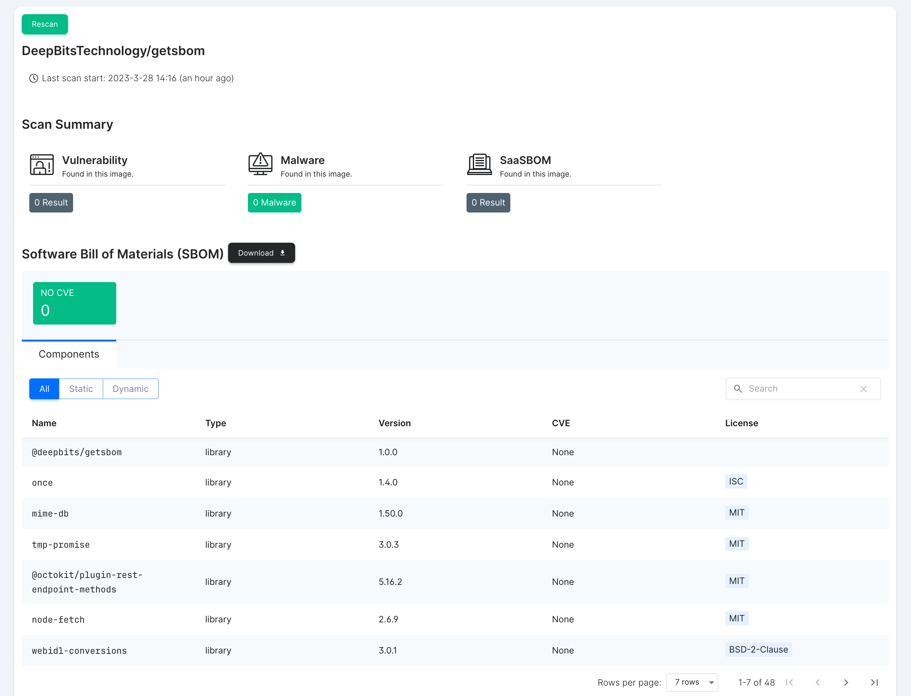

<p align="center">
  
</p>

<p align="center">
  <a href="https://tools.deepbits.com/github/DeepBitsTechnology/getsbom"></a>
</p>

# Deepbits SBOM Action

A **free** Github action for open-source projects that enables automated creation and risks (vulnerability, license, malware, etc.) analysis of software bill of materials (SBOM) from code repositories.

Powered by [Deepbits](https://www.deepbits.com/).

## Features

- Easy to set up and use.
- Scan your code repositories to identify hidden malware.
- Create Software Bill of materials (SBOM) for your code repositories.
- Analyze SBOMs of your project to identify vulnerabilities and license issues.
- Leverage AI and program analysis to deliver better accuracy and performance.

**Note:** This action only supports **public repositories** at the moment. Private repositories are not supported.

## Basic Usage

To use this action, simply add it as a step in your GitHub Actions workflow:

```yaml
- uses: DeepBitsTechnology/getsbom@v1
```

## Example Usage

```yaml
jobs:
  deepbits-scan:
    runs-on: ubuntu-latest
    outputs:
      SCAN_BADGE: ${{ steps.deepbits-scan.outputs.DEEPBITS_BADGE }}
      DEEPBITS_COMMIT_LINK: ${{ steps.deepbits-scan.outputs.DEEPBITS_COMMIT }}
      DEEPBITS_REPO_LINK: ${{ steps.deepbits-scan.outputs.DEEPBITS_REPO }}
    steps:
      - uses: DeepBitsTechnology/getsbom@v1
        id: deepbits-scan
```

## Actions Artifact

After the scan is complete, an artifact named `DEEPBITS_SCAN_RESULTS` will be generated, which contains two files:

| Output                                       | Description                                                                                                                                                                                                      |
| -------------------------------------------- | ---------------------------------------------------------------------------------------------------------------------------------------------------------------------------------------------------------------- |
| deepbits-sbom-{{owner}}-{{repo}}-{{sha}}.zip | A ZIP file consists of the SBOM result, along with the signature of the SBOM and Deepbits’ certificate required for verifying the signature. (For example: deepbits-sbom-DeepBitsTechnology-getsbom-14c9954.zip) |
| scanSummary.json                             | Scan result contains vulnerability and malware summary in JSON format                                                                                                                                            |

The structure of the `deepbits-sbom-{{owner}}-{{repo}}-{{sha}}.zip` file is as follows:

| FileName                                  | Description                                                                                |
| ----------------------------------------- | ------------------------------------------------------------------------------------------ |
| {{owner}}-{{repo}}-{{sha}}.CycloneDX.json | SBOM in CycloneDX format. (For example: DeepBitsTechnology-getsbom-14c9954.CycloneDX.json) |
| CycloneDX.signature.bin                   | The signature of the SBOM                                                                  |
| deepbits.cert                             | Deepbits’ certificate required for verifying the signature                                 |
| README.md                                 | Contains instructions on how to verify the signature                                       |

**We have included a sample folder called `sample_scan_results` in the repository [here](./samples/DEEPBITS_SCAN_RESULTS/).**

It contains example artifacts generated by our action that you can use to analyze and view scan results.

We hope that these examples will help you understand the capabilities of our action and how it can enhance the security and compliance of your project.

## Actions Outputs

In addition to the artifact, you may also view the scan results and your previous scan histories on [DeepRepo](https://tools.deepbits.com/github).

Additionally, a SVG is available that can be included in your README file.

To obtain these outputs, please refer to the three options listed below:

| Output          | Description                                                 |
| --------------- | ----------------------------------------------------------- |
| DEEPBITS_REPO   | The URL to access the repo details of DeepRepo              |
| DEEPBITS_COMMIT | The URL to access the scan report of the commit on DeepRepo |
| DEEPBITS_BADGE  | A SVG badge displaying the status of the the repo           |

You can add the SVG badge to your README.md file like this:

```markdown
[]({{DEEPBITS_REPO}})
```

For example, the badge for this repository is:

```markdown
[](https://tools.deepbits.com/github/DeepBitsTechnology/getsbom)
```

[](https://tools.deepbits.com/github/DeepBitsTechnology/getsbom)

**The image below is a screenshot of a scan result on [DeepRepo](https://tools.deepbits.com/github), which is accessible through the `DEEPBITS_COMMIT` output.**



The scan results displayed in DeepRepo are interactive and allow you to view detailed information about the components used in your project, as well as any vulnerabilities or licensing issues detected during the scan.

Click [this URL](https://tools.deepbits.com/github/DeepBitsTechnology/getsbom/d29263777ef33157254ff4207ca00cedf0d537e1) to see the comprehensive view of the screenshot results.

## License

This project is licensed under the MIT License. Please see the `LICENSE` file for more information.

## Support

If you encounter any issues or have any questions about the Deepbits SBOM Scanner GitHub Action, please feel free to contact us at [help@deepbits.com](mailto:help@deepbits.com). We are always happy to help!
